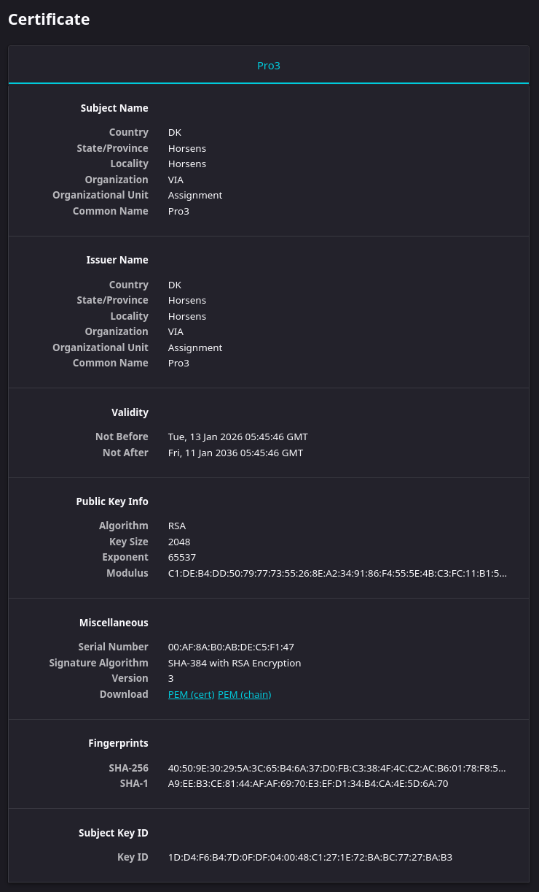

# Generate a self-signed certificate (for dev/testing)

Use keytool (comes with JDK):
```bash
keytool -genkeypair -alias slaughterhouse -keyalg RSA -keysize 2048 -storetype PKCS12 -keystore slaughterhouse.p12 -validity 3650
```
You will be prompted to enter passwords and info.

This generates slaughterhouse.p12 keystore file.

# Put the keystore file in your project src/main/resources 
# Certificated generated
